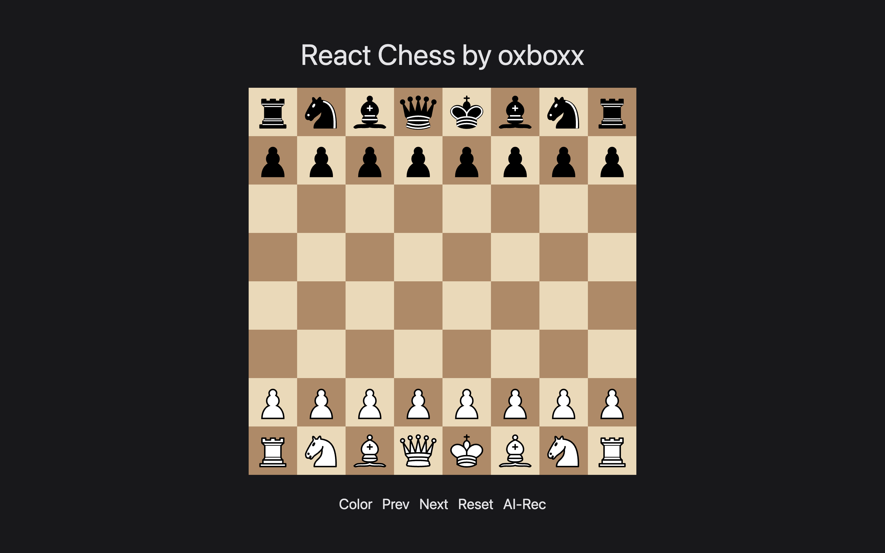

# React Chess with Stockfish

## 프로젝트 소개

React Chess with Stockfish는 온라인 보드게임 플랫폼 [KU-OBP](https://github.com/ku-obp/ku-obp)의 일환으로 개발된 React 기반 AI 체스 게임입니다. KU-OBP의 체스 게임 부분만을 분리하여 독립된 프로젝트로 만들었습니다. AI 기능은 오픈소스 체스 엔진 [Stockfish](https://github.com/official-stockfish/Stockfish)를
활용하여 구현되었습니다.

[게임 바로가기](https://oxboxx.github.io/react-chess)

## License

This project is distributed under the [GNU General Public License version 3 (GPLv3)](https://www.gnu.org/licenses/gpl-3.0.html). This license applies to all components within this project, including the [Stockfish](https://stockfishchess.org) chess engine that is used by this project.

Should any part of this project, including the Stockfish engine, be distributed or modified, it is mandatory to adhere to the conditions of the GPL v3 license. This includes the following obligations:

When distributing or distributing a modified version of this project, the GPL v3 license text and the source code (or a way to access the source code) must be included.
If there are changes to the source code, these changes must also be made public under the GPL v3 license.
For more detailed information regarding the use of this project, or starting a new project using the code from this project, please refer to the [GPL v3 license text](https://www.gnu.org/licenses/gpl-3.0.html).
